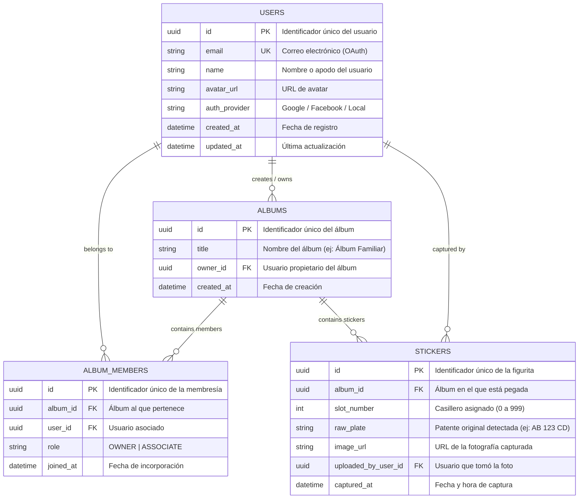

# Documentación de la Base de Datos y Diagrama Entidad-Relación (DER)

## Modelo de Datos

La base de datos relacional (PostgreSQL) está estructurada para garantizar integridad referencial, alta velocidad de consulta por casillero (000-999) y escalabilidad sin costo de infraestructura.

## Índices y Restricciones de Dominio
- **`STICKERS_unique_album_slot`**: Restricción de unicidad compuesta `(album_id, slot_number)`. Evita la duplicación de figuritas en un mismo casillero dentro del mismo álbum.
- **`slot_number`**: Número entero indexado validado entre `0` y `999`.
- **`ALBUM_MEMBERS_unique_album_user`**: Restricción de unicidad compuesta `(album_id, user_id)` para evitar invitaciones duplicadas.
